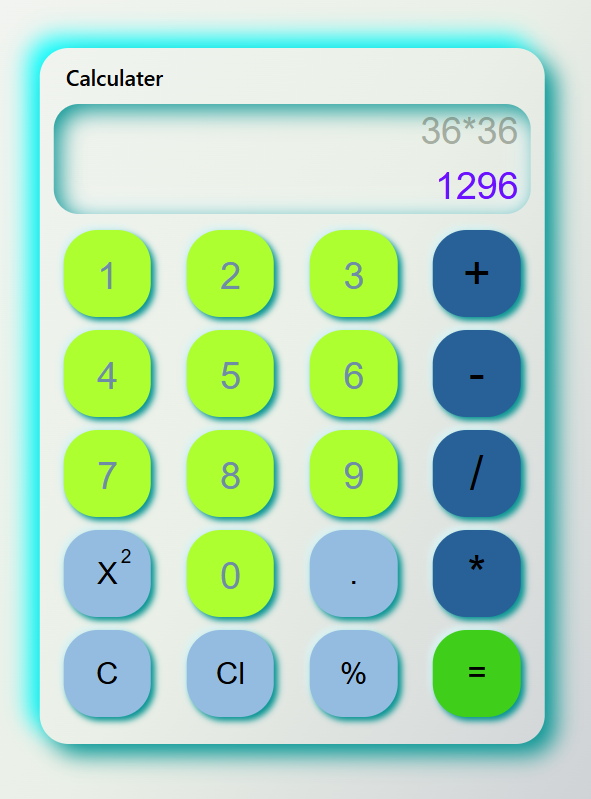

# Calculator

This project demonstrates a basic calculator built using HTML, CSS, and JavaScript.

Features:

<ul>
<li>Performs basic arithmetic operations (addition, subtraction, multiplication, division)</li>
<li>Displays the user's input and calculated result</li>
</ul>

Using the Calculator:

<ul>
<li>Enter numbers using the numeric buttons (0-9).</li>
<li>Click the operator buttons (+, -, *, /) to perform arithmetic operations.</li>
<li>Use the "C" button to clear the current input.</li>
<li>Press "=" or click to calculate the result.</li>
</ul>

